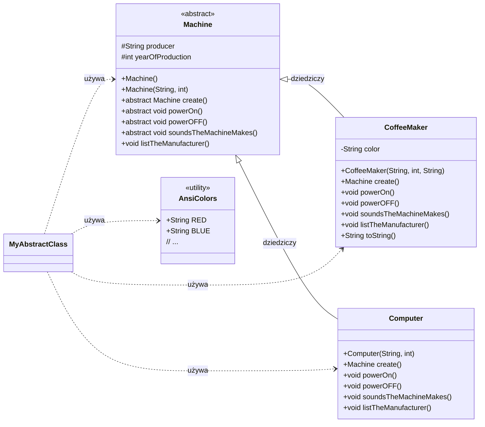

# 🆚 **Interfejs vs. Klasa Abstrakcyjna**

| **Cecha** | **Interfejs (`interface`)** | **Klasa Abstrakcyjna (`abstract class`)** |
|----------|------------------------------|---------------------------------------------|
| **Przeznaczenie** | Definicja kontraktu (zachowania, API). | Definicja podstawowej jednostki w hierarchii dziedziczenia. |
| **Metoda dziedziczenia** | `implements` | `extends` |
| **Wielokrotność** | Klasa może implementować wiele interfejsów jednocześnie. | Klasa może dziedziczyć tylko jedną klasę abstrakcyjną. |
| **Metody abstrakcyjne** | Domyślnie publiczne; nie wymagają słowa `abstract`. | Muszą być jawnie oznaczone jako `public abstract`. |
| **Metody z ciałem** | Tak — od Java 8: `default` i `static`. | Tak — mogą zawierać dowolne metody z pełną implementacją. |
| **Pola (zmienne)** | Tylko stałe: `public static final`. | Mogą zawierać dowolne pola: publiczne, prywatne, chronione, modyfikowalne. |
| **Konstruktor** | ❌ Brak możliwości definiowania konstruktora. | ✔ Może posiadać konstruktor — używany przez podklasy. |
| **Stan obiektu** | Nie przechowuje stanu (brak pól instancji). | Może przechowywać stan (pola obiektowe). |

---

# 🔍 **Kiedy Wybrać Który?**

## 🟢 **Wybierz Interfejs, gdy...**
- Chcesz zdefiniować **kontrakt zachowania** (np. `Printable`, `Sortable`).
- Potrzebujesz **wielokrotnego dziedziczenia** (np. `Scanner` i `Printer`).
- Tworzysz **interfejs funkcyjny** używany w lambdach.

## 🟡 **Wybierz Klasę Abstrakcyjną, gdy...**
- Chcesz dostarczyć **bazową implementację i stan** (np. `abstract class Zwierzę`).
- Potrzebujesz **konstruktora** do inicjalizacji podklas.
- Musisz użyć **pól prywatnych/chronionych**.
- Projektujesz **stabilną hierarchię** dziedziczenia.

---

# 🛠️ Podsumowanie Struktury Klas Abstrakcyjnych **Machine**

Ten projekt jest wzorcowym przykładem użycia klas abstrakcyjnych i polimorfizmu w języku Java, demonstrującym hierarchię obiektów z odziedziczonym kontraktem.

---

## 1. 🏗️ **Hierarchia Klas**

| **Klasa**       | **Typ**                 | **Kluczowe Cechy**                                                                 | **Modyfikator Dostępu** |
|-----------------|--------------------------|-------------------------------------------------------------------------------------|---------------------------|
| **Machine**     | Abstrakcyjna (Baza)     | Definiuje wspólny kontrakt (metody abstrakcyjne) oraz współdzielone pola (`producer`, `yearOfProduction`). | `abstract` |
| **CoffeeMaker** | Konkretna (Potomna)     | Implementuje metody abstrakcyjne. Dodaje unikalne pole `color`.                    | `public` |
| **Computer**    | Konkretna (Potomna)     | Implementuje wszystkie metody abstrakcyjne z `Machine`.                            | `public` |
| **AnsiColors**  | Narzędziowa (Utility)   | Zawiera stałe z kodami ANSI do kolorowania wyjścia konsoli.                        | `public final` |
| **MyAbstractClass** | Uruchamiająca (Main) | Demonstruje użycie polimorfizmu i klasy anonimowej.                                 | `public` |

---

## 2. 📝 **Kluczowe Mechanizmy**

| **Mechanizm**     | **Opis** | **Przykład w Kodzie** |
|-------------------|----------|------------------------|
| **Abstrakcja** | Klasa `Machine` wymusza implementację wspólnych zachowań w podklasach. | `public abstract void powerOn();` |
| **Polimorfizm** | Referencja typu `Machine` może wskazywać na różne obiekty potomne (np. `CoffeeMaker`, `Computer`). | `Machine coffeeMaker = new CoffeeMaker(...);` |
| **Hermetyzacja** | Pola w `Machine` są `protected`, dzięki czemu podklasy mają bezpośredni dostęp. | `protected String producer;` |
| **Wzór Prototypu** | Metoda `create()` klonuje obiekt (tworzy nową identyczną instancję). | `Machine secondMaker = firstMaker.create();` |
| **Przesłanianie (Overriding)** | Podklasy dostarczają własną implementację odziedziczonych metod. | `@Override public void powerOn() { ... }` |

---

# 📐 Diagram Klas (Mermaid)
- Poniższy kod ilustruje, jak klasa abstrakcyjna Machine narzuca kontrakt na konkretne podklasy (CoffeeMaker i Computer).

